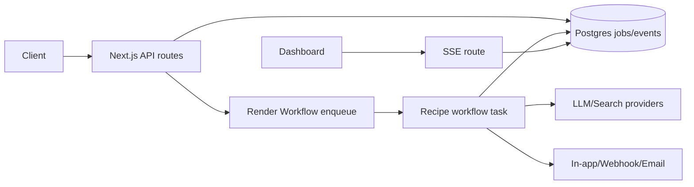

# Architecture

Relay is split into three replaceable layers.

## State Machine

`queued -> processing -> retrying -> complete`

Terminal alternatives are `failed` and `cancelled`. Workers check cancellation between steps and write status transitions to `job_events`.

## Realtime

The local implementation uses an in-process event bus. Production should map the same publish/subscribe boundary to Postgres `LISTEN/NOTIFY`, or Redis pub/sub when `REDIS_URL` is set.

## Delivery

Completion calls the delivery layer. In-app delivery marks the result unread, webhook delivery signs the JSON payload with HMAC-SHA256, and email delivery is gated by provider configuration.
